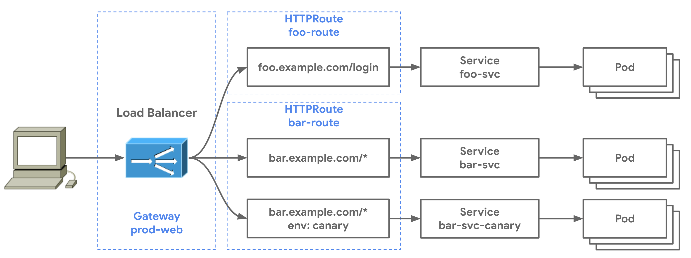

# Overview

This project implements the __Kubernetes Gateway API__ which is a generic specification for Kubernetes-native API Gateways to implement. In this system, we're using the __NGINX Gateway Fabric__ implementation of that specification.

The figure below depicts, in general, how this resource fits in our architecture.

# To Run
* Run `bash ./deploy.sh` to apply the Kubernetes manifests that define the gateway configuration.
